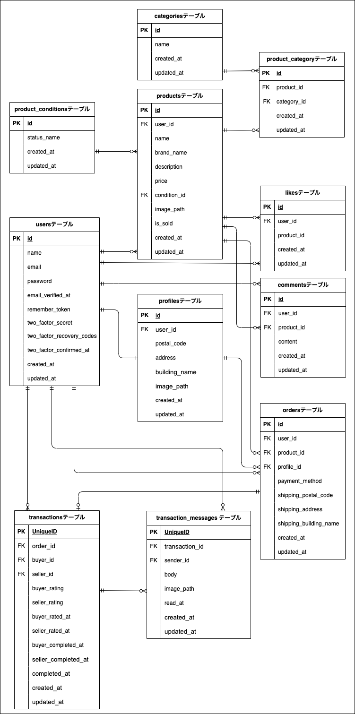

# furima-app-test　環境構築

## Dokerビルド

- git clone git@github.com:TomoeHayano/furima-app-test.git
- docker-compose up -d --build

## laravel環境構築

- docker-compose exec php bash

- composer install

- cp .env.example .env

- php artisan key:generate

- php artisan migrate

- php artisan db:seed

- php artisan storage:link

## 開発環境
- 商品一覧画面(トップ画面):http://localhost/
- 会員登録:http://localhost/register
- ログイン画面:http://login
- phpMyAdmin:http://localhost:8080
- mailHog:http://localhost:8025

## 使用技術（実行環境）
- nginx:1.21.1
- mysql:8.0.26
- docker:3.8
- php:8.1

## Stripe実行方法（支払い方法選択）
- テスト用クレジットカード：4242 4242 4242 4242（有効期限・CVC は任意の未来日と 3 桁）

## 環境変数
- .envとenv.testingに 
STRIPE_KEY・STRIPE_SECRET　は未設定のため、KEYの取得をお願いいたします。

## 仕様書に詳細記載がない追加機能 鈴木北斗コーチから以下機能の指示をいただきました　　

- Figmaにメール認証画面がないためメール認証誘導画面と同一でよいとお聞きしています。
- ヘッダーのロゴをクリックでトップページへ遷移させる 
ログイン後：商品一覧画面（トップ画面）_マイリスト 
ログイン前（ゲスト）：商品一覧画面（トップ画面）
- 出品した商品>商品詳細ページに遷移、ただしボタンを無効化する(いいね、コメントは出来る)
- SOLDした商品>商品詳細ページに遷移、ただしボタンを無効化する(いいね、コメントは出来る)

## Unitテスト実行方法
- このプロジェクトでは、LaravelのFeatureテストを一部実装しています。 
テスト実行環境はDockerコンテナ内で完結します。

### 初期設定
- docker-compose exec php bash
- mysql -u root -p 
※ パスワード: root
- CREATE DATABASE demo_test;
- exit
- docker-compose exec php bash
- php artisan key:generate
- php artisan migrate:fresh --env=testing

### 実行手順
- docker-compose exec php bash
- php artisan test tests/Feature/＊各ファイル名＊

### ユーザー情報
- name：Seller One 
email：seller1@example.com 
password：111111111 
出品商品：CO01 腕時計 
CO02 HDD 
CO03　玉ねぎ3束 
CO04　革靴 
CO05　ノートPC 
       
- name：Seller Two 
email：seller2@example.com 
passwor：111111111 
出品商品：CO06　マイク 
CO07　ショルダーバッグ 
CO08　タンブラー 
CO09　コーヒーミル 
CO10　メイクセット 

- name：Unassigned User 
email：user3@example.com 
password：111111111

## ER図

